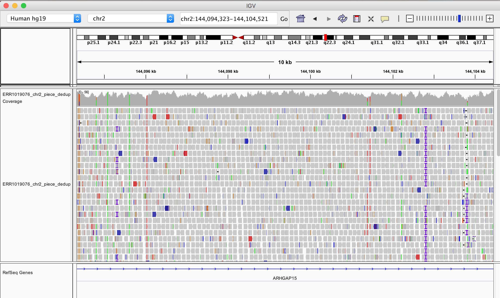

# Mapping and SNP calling exercise

As we learned last week, high-throughput sequencing technologies have in the past few years been producing millions of reads of human genome and other species. To be useful, this genetic information has to be 'put together' in a smart way, in the same way as the pieces of a puzzle (reads) need to be mounted according to a picture (reference genome). In this exercise section you will be exposed to different softwares used for mapping reads to a reference sequence and calling variants from the produced alignments. We will use a dataset composed of 28 individuals from 3 different regions: Africa, EastAsia and WestEurasia. You can find the metadata file, containing sample IDs and some extra information for each sample here: ~/populationgenomics/data/metadata/Sample_meta_subset.tsv


This dataset is a subset of the Simons Diversity Project (discussed last week).

## Log into the cluster and request a compute node

Log into the cluster. Then request a machine for your computations. You need five gigabytes (`5g`) in this exercise so you need to run this command (see also the explanation in the previous exercise):

```bash
srun --mem-per-cpu=5g --time=3:00:00 --account=populationgenomics --pty bash
```

Remember to activate your conda environment before running the below commands.

## Data source

You will be separated in pairs so you can help each other out with the commands. Each of you will be responsible for 2 individuals and at the end of this exercise we will estimate the mean SNP heterozygosity per individual of the 10 MB region in chromosome 2. You should introduce you results [here](https://docs.google.com/spreadsheets/d/1OEHI1tNiwHrwKkl9L5rPtbVKCHQDpCZtKzpnZ1sWKJY/edit?usp=sharing) 

The following tutorial is based on **S_Ju_hoan_North-3**.

## Mapping reads against the reference

The first step when dealing with raw reads is mapping (aligning) them to a reference sequence. For this, we will be using the BWA mapper. BWA stands for Burrows-Wheeler aligner, which allows for fast and accurate alignment of short reads to an indexed reference sequence. [Here](http://bio-bwa.sourceforge.net/bwa.shtml) is the manual. We decided to focus on a 10 MB region of chromosome 2 (from 135MB to 145MB), which contains the lactase gene.

Two input files are needed to do genome mapping:

- Fasta file containing your reference genome Which was downloaded from:
    ([hg19](https://hgdownload.soe.ucsc.edu/goldenPath/hg19/chromosomes/chr2.fa.gz))
    The path to the fasta file the referense sequence for the human chromosome 2 is here:
    ~/populationgenomics/fasta/chr2_135_145_subsampl.fa
- The reads in fastq format, which can be found in this shared folder:
    ~/populationgenomics/data/fastq/

We will create a soft-link of fasta reference to your folder, so that we don't need to type in the full path to the reference everytime we want to use it and avoid copying it to out own directory. Change username to your user account. You might also want to create a separate folder inside your own folder, contianing the exercises for this week. Update the path to your own directory as you see fit.

```bash
    ln -s ~/populationgenomics/fasta/chr2.fa ~/populationgenomics/students/username
```

First we need to index the reference file for later use. This creates index files used by bwa mem to perform the alignment. To produce these files, run the following command:

<!-- 3m41.487s -->
```bash
    bwa index -p chr2 -a bwtsw chr2.fa 
```

where -p gives the path for the index files produced, while -a bwtsw specifies the indexing algorithm, bwtsw is capable of handling the human genome.

You also need to generate a fasta file index. This can be done using **samtools**:

<!-- 0m0.914s -->
```bash
    samtools faidx chr2.fa
```

We will also create a soft link for the fastq files we want to map to the reference sequence. Please update the path to your own account and samplename with your sample ID. For example, in our case it would be S_Ju_hoan_North-3.

```bash
ln -s ~/populationgenomics/data/fastq/samplename.chr2.fq ~/populationgenomics/students/username
```

Now you can map the reads to the reference. This will take around 7 minutes. You can start installing the software that will be used later in this tutorial (IGV) while you wait for it.

<!-- 6m7.240s -->
```bash
    bwa mem -t 16 -p chr2 S_Ju_hoan_North-3.region.fq | samtools sort -O BAM -o S_Ju_hoan_North-3.bam
```

This command is composed of two sub-commands where the output of the "bwa mem" command is piped ("|" is the pipe symbol) into the "samtools sort" command. The output of the "bwa mem" command is an unsorted bam file, which is then used as input into the "samtools sort" command to produce a sorted bam file, which is necessary for further analysis. We could also run the two commands separately, but by using piping we save disc space, as we do not have to save the intermediate unsorted bam file, and altogether speed up the analysis.

You can have a look at the bam file generated:

<!-- 0m0.005s -->
```bash
    samtools view S_Ju_hoan_North-3.bam | head
```

Bam files follow this structure:


- Read name: ID for the given read.
- Flags: Combination of bitwise FLAGs that provide information on how the read is mapped  [Extra information](https://broadinstitute.github.io/picard/explain-flags.html).
- Position: Chromosome and position of the first base in the alignment. 
- MAPQ: Probability of wrong mapping of the read. It's in Phred scale, so higher numbers mean lower probabilities:

- CIGAR: summary of the alignment, including start position on the reference sequence, matches, mismatches, deletions and insertions. It may also include information on soft/hard clipping, i.e bases in the 3' and 5' ends of teh read that are not part of the alignment.
[Extra information](https://wiki.bits.vib.be/index.php/CIGAR)
- Mate information: chromosome and start position of teh read pair, and inferred insert size.
- Quality scores: base qualities of the read.
- Metadata: optional extra information. 

For more information, read [this](https://samtools.github.io/hts-specs/SAMv1.pdf)

You can get some useful stats of your mapping, by running samtools flagstat:

<!-- 0m2.144s -->
```bash
    samtools flagstat S_Ju_hoan_North-3.bam 
```

In order to visualize the alignment of the reads to the reference genome we have just produced, we will use IGV. But first, we need to generate an index file for this software to work. Indexing a genome sorted BAM file allows one to quickly extract alignments overlapping particular genomic regions. Moreover, indexing is required by genome viewers such as IGV so that the viewers can quickly display alignments in each genomic region to which you navigate.

<!-- 0m2.706s -->
```bash
    samtools index S_Ju_hoan_North-3.bam 
```

## Downloading via terminal

You can download the data via terminal by the following:

```bash
    scp username@login.genome.au.dk:populationgenomics/students/username/S_Ju_hoan_North-3.bam* folder_on_your_computer
```
Note that by using the suffix bam* ,we will be downloading all files that start with S_Ju_hoan_North-3.ba, which in this case should be both the BAM and BAI files.

## IGV software

IGV is an Integrative Genomics viewer and can be very useful to look at the results of Mapping and SNP calling. We have not installed it in the cluster, so you can download it to your machine you can go to its [website](http://software.broadinstitute.org/software/igv/). Three files are necessary to look at this dataset: a reference sequence and the
**.bam** and **.bai** files, download it from the cluster in a specific directory. Since we are using a human reference, the sequence is already available in the software:

Go to Genomes ----> Load Genome from server... ----> Filter by human and choose the Human hg19 reference.

After it you will the chromosomes and genes. Now you can download the mapping results by typing: File ----> Load from File... ----> S_Ju_hoan_North-3.bam.

When you zoom in to the lactase region on chromosome 2 (chr2:136,545,410-136,594,750), you will see something like this: 

Try to understand what are the different attributes present in the viewer. If you zoom in very much you will find single nucleotide polymorphisms (SNPs), where the reference sequence does not have the same nucleotide as the data mapped to.

## Analyzing read coverage

Now log back into the cluster.

One of the attributes one could learn from mapping reads back to the reference is the coverage of reads across the genome. In order to calculate the coverage depth you can use the command **samtools depth**.

<!-- 0m8.062s -->
```bash
    samtools depth S_Ju_hoan_North-3.bam > S_Ju_hoan_North-3.coverage
```

You can have a look at the resulted file. What do you find in the three different columns?

```bash
    less S_Ju_hoan_North-3.coverage
```

Log out of the cluster and fire up a jupyter notebook using `slurm-jupyter` (see the first exercise for how to do that). For this exercise, specify the memory to 5g (-m 5g). Once jupyter is up and running in your browser, create a new R notebook.

Run the following code in separate code cells:

```R
library(ggplot2)
library(dplyr)
```

```R
scaf <- read.table("S_Ju_hoan_North-3.coverage",header=FALSE, sep="\t", na.strings="NA", dec=".", strip.white=TRUE, col.names = c("Scaffold", "locus", "depth"))
    
head(scaf)
```

```R
# Compressing the dataframe in windows
scaf %>% 
mutate(rounded_position = round(locus, -2)) %>%
    group_by(rounded_position) %>% 
        summarize(mean_cov = mean(depth)) -> compressed

# Plotting the data
p <- ggplot(data =  compressed, aes(x=rounded_position, y=mean_cov)) + geom_area() + theme_classic() + ylim(0, 400)

# Saving your coverage plot
ggsave("S_Ju_hoan_North-3.coverage.pdf",p)
```

What are the conclusions you can extract from these analysis? Does the coverage match with what you observed with IGV? Does it match with what you would expect, i.e what you know from the data? 

## SNP calling

Even though just a tiny portion (around 2%) of our genomes are based of protein coding regions, this partition contains most of the disease causal variants (mutations), and that is why variant calling is so important from a medical point of view. From the population genetics side of view it is also possible to use these variants to establish differences between individuals, populations and species. It can also be used to clarify the genetic basis of adaptation. These topics will come back to your mind during the following weeks.

Once we have mapped our reads we can now start with variant detection. We will use the software **Platypus**: a tool designed for efficient and accurate variant-detection in high-throughput sequencing data. You can access their website [here](http://www.well.ox.ac.uk/platypus). 

To run platypus, we can use this line of code:

<!-- 0m22.420s -->
```bash
platypus callVariants --bamFile=S_Ju_hoan_North-3.bam --refFile=chr2.fa --output=S_Ju_hoan_North-3.vcf
```

The output will be a single [VCF](http://samtools.github.io/hts-specs/VCFv4.2.pdf) file containing all the variants that Platypus identified, and a 'log.txt' file, containing log information.

Look at the output vcf file. What does the format look like? Does that match with what you observed in the IGV? Download the VCF file to the IGV browser.

```bash
less -S S_Ju_hoan_North-3.vcf 
```

You will be using this format further in the course, for now let's just count the number of heterozygous SNPs in each individual:

```bash
grep -o '0/1\|1/0' S_Ju_hoan_North-3.vcf | wc -l
```

-   0/0 - the sample is homozygous to the reference (note that these sites usually won't be listed in single sample vcf files as they are not variants)
-   0/1 OR 0/1 - the sample is heterozygous, carrying 1 copy of each of the REF
    and ALT alleles
-   1/1 - the sample is homozygous for the alternate allele

Given this information you are now able to estimate the mean heterozygosity for your individual of the 10 MB region in chromosome 2.
