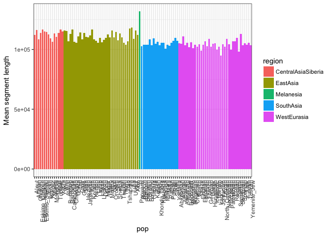

Detecting archaic ancestry in modern humans
-------------------------------------------

The dataset you will be working in this exercise section was kindly
provided by Laurits Skov, the author of the paper you discussed on Monday. He has called archaic fragments
using his method in a large number of individuals from the Simons genome
diversity project and from the 1000 genomes project, paper
[here](https://www.biorxiv.org/content/early/2018/03/16/283606.full.pdf).
We will introduce you to the data format and then you should aim to
answer some of the questions that we pose below.

``` r
archaic_df = read.table('~/Dropbox/PG2018/exercises/archaic_segments/ArchaicSegments.txt',
    sep='\t', header = T)

# How many individuals do we have?
length(unique(archaic_df$name))
```

    ## [1] 358

``` r
# How many populations?
length(unique(archaic_df$pop))
```

    ## [1] 110

``` r
# How many regions?
unique(archaic_df$region)
```

    ## [1] EastAsia           WestEurasia        CentralAsiaSiberia
    ## [4] SouthAsia          Melanesia         
    ## Levels: CentralAsiaSiberia EastAsia Melanesia SouthAsia WestEurasia

``` r
# Average archaic segment length by population:
mean_seg_pop <- archaic_df %>%
        group_by(pop, region) %>%
        summarise(`Mean segment length` = mean(length))
  
mean_seg_pop %>%
 ungroup() %>%
  arrange(region) %>% 
    mutate(pop = factor(pop, pop)) %>%
        ggplot(aes(x = pop, y = `Mean segment length`, fill = region)) + 
            geom_bar(position = "dodge", stat="identity") + 
            theme_bw() +
            theme(axis.text.x = element_text(angle = 90, hjust = 1))
```



``` r
# What is the population with the highest average segment length?
mean_seg_pop[which.max(mean_seg_pop$`Mean segment length`),]
```

    ## # A tibble: 1 x 3
    ## # Groups:   pop [1]
    ##   pop     region    `Mean segment length`
    ##   <fct>   <fct>                     <dbl>
    ## 1 Papuans Melanesia                131784

``` r
# What is the average length of segments by region?
mean_seg_region <- archaic_df %>%
        group_by(region) %>%
        summarise(`Mean segment length` = mean(length)) 

# Can you plot it?
ggplot(mean_seg_region, aes(x = region, y = `Mean segment length`)) +  
    geom_bar(position = "dodge", stat="identity") 
    + theme_bw()
```


The lengths of Archaic fragments
--------------------------------

The lengths of the fragments are given by the length variable and is
regarding the segments that appear to have too many SNPs after the
African SNPs have been filtered away (see Laurits’ method). You will
first look at these before classifying them into their most likely
archaic origin

##### Q1. Find the total lengths of Arcahic fragments in each individual.

##### Q2. Summarise the total length per population and per region.

##### Q3. Which population has most archaic ancestry? Why?

##### Q4. What is the length distribution of fragments for the five different regions (hint: you can use facet\_grid to plot all at once).

##### Q5. What is the average length of fragments for each population and each region?

##### Q6. What can cause different mean fragment lengths?

##### Q7. If you have a recombination rate of 1cM per Megabase, how many generations do your average fragment length for the different regions then correspond to? How many years is that if generation time=30 years.

##### Optional question: Combining all individuals, how large a fraction of the genome contains archaic segments?

The origin of archaic fragments
-------------------------------

Following the Cell paper method you can assign individuals fragments to
archaic origin using the number of SNPs they share with Denisovans,
Altai Neanderthal and Vindija Neanderthal. Let us make it simple and say
that you assign a fragment to the archaic species that its shares most
SNPs with. If there are equally many SNPs shared then share the fragment
between the two individuals. If there are no SNPs shared with any of the
archaics then considewr the fragment unassigned.

##### Q1. For each individual, assign the archaic segments to origin and reconstruct a Figure in the same style as Figure 5 of the Cell paper (plot below).


##### Q2. What are major differences? What can explain these differences?

##### Q3. Summarize the results by averaging over region and plot these.

##### Q4. How much of the Neanderthal genome (combining Vindija and Altai) and the Denisovan genomes can be reconstructed in total?

##### Q5. Can you find any evidence of the second Denisova in the East Asian genomes? (hint: compare the ratio of denisovans snps to total snps in the denisovan fragments).

##### Q6. Determine the fragment length distribution of segment of Neanderthal and Denisova origin separately for each region. Compare the mean of the distributions.

###### a. What can cause the differences you observe?

###### b. How does this compare to the fragment size distribution of the fragments that could not be assigned to archaic origin (these are removed from the Cell paper analyses). Discuss reasons for the differences.

Comparison of chromosomes
-------------------------

You can also investigate how the introgression events are distributed
along the genome.

##### Q1. Determine the amount of archaic introgression on each chromosome for each of the five regions.

##### Q2. Repeat this with assignment of archaic regions to archaic species.

##### Q3. Combine the Neanderthal fragments for all individuals and plot all the fragments on top of each other (as proxy for the site frequency disitribution) along chromosomes (hint use alpha = 0.1). Can you find “deserts” of archaic admixture and/or evidence for places where Neanderthal ancestry has reached very high frequency?

##### Q4. You will find that the X chromosome is an outlier (compare to a chormossome of a similar size - chr8). How and why?

##### Q5. Repeat the analysis with Denisova fragments.

##### Q6. Do you find regions that are devoid of introgression for both the Neanderthal and the Denisovan admixture events?
