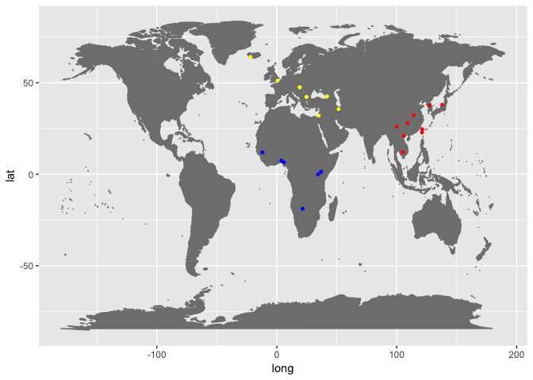

# Mapping and SNP calling exercise

As we learned last week, high-throughput sequencing technologies have in the past few years been producing millions of reads of human genome and other species. To be useful, this genetic information has to be 'put together' in a smart way, in the same way as the pieces of a puzzle (reads) need to be mounted according to a picture (reference genome). In this exercise section you will be exposed to different softwares used for mapping and snp calling. We will use a dataset composed of 30 individuals from 3 different regions: Africa, EastAsia and WestEurasia.

    ##       X...ID    ENA.RUN    population region country latitude longitude
    ## 1 ERS1042176 ERR1019075 Ju_hoan_North Africa Namibia    -18.9      21.5
    ## 2 ERS1042177 ERR1019076 Ju_hoan_North Africa Namibia    -18.9      21.5
    ## 3 ERS1042248 ERR1025622          Esan Africa Nigeria      6.5       6.0
    ## 4 ERS1042265 ERR1025639         Luhya Africa   Kenya      1.3      36.8
    ## 5 ERS1042266 ERR1025640      Mandenka Africa Senegal     12.0     -12.0
    ## 6 ERS1042267 ERR1025641      Mandenka Africa Senegal     12.0     -12.0
    ##      Sex       Illumina.ID
    ## 1   male LP6005441-DNA_B11
    ## 2   male LP6005441-DNA_A11
    ## 3 female LP6005442-DNA_B10
    ## 4   male LP6005442-DNA_E11
    ## 5   male LP6005441-DNA_E07
    ## 6 female LP6005441-DNA_F07

This dataset is a subset of the Simons Diversity Project, and as you can see, it covers a bit of the diversity of human population. If you want to go further in details about this project and results, you can click [here](https://www.nature.com/articles/nature18964).

## Log in to the server via terminal

### For windows users

    plink -P 8922 [user]@185.45.23.197

### For mac users

    ssh -p 8922 [user]@185.45.23.197

## Data source

You will be separated in pairs so you can help each other out with the commands. Each of you will be responsible for 2 individuals and at the end of this exercise we will estimate the SNP heterozygosity per individual. The data is placed in a folder called **Data** in the same directory as users folder. The individuals for each person is written in the spreadsheet
[here](https://docs.google.com/spreadsheets/d/1OEHI1tNiwHrwKkl9L5rPtbVKCHQDpCZtKzpnZ1sWKJY/edit?usp=sharing).
In the following tutorial I am using one individual as an example **ERR1019076**, please replace it by the individual you've got.

## Mapping reads against the reference

We will be using the bwa mapper. If you are interested in understanding a bit more of the software and its algorithm, you can look it up [here](http://bio-bwa.sourceforge.net/bwa.shtml). We have thousands of reads and we want to find out their best location in the genome. We decided to focus on a 10 MB region of chromosome 2, which can be downloaded through [Ensembl](ftp://ftp.ensembl.org/pub/release-75//fasta/homo_sapiens/dna/). This region goes from 135MB to 145MB and it is known to containg the lactase gene.

Two input files are needed to do genome mapping:

- Fasta file containing your reference genome
    ([GRCh37](http://grch37.ensembl.org/index.html))
- The reads in fastq format

First we need to index the reference file for later use. This step is important for the speed and process of the mapping algorithm. It takes around 4 minutes. This creates a collecion of files that are used by BWA to perform the alignment.

Create a soft-link of fasta reference to your folder:

    ln -s /home/Data/Homo_sapiens.GRCh37.75.dna.chromosome.2.fa /home/user_name/

Then produce the indexes needed for bwa mapper:

    bwa index -p Homo_sapiens.GRCh37.75.dna.chromosome.2 -a bwtsw Homo_sapiens.GRCh37.75.dna.chromosome.2.fa

You also need to generate a fasta file index. This can be done using **samtools**:

    samtools faidx Homo_sapiens.GRCh37.75.dna.chromosome.2.fa

Now you can map the reads back to the reference. This will take around 10 minutes. You can start installing the software that will be used later in this tutorial (IGV) while you wait for it.

    bwa mem -t 16 -p Homo_sapiens.GRCh37.75.dna.chromosome.2 /home/Data/sorted_ERR1019076_reads_135_145.fq | \
    samtools sort -O BAM -o ERR1019076.bam

Have a look at the bam file generated:

    samtools view ERR1019076.bam | head

Get some useful stats of your mapping:

    samtools flagstat ERR1019076.bam

Once the map is generated, you can index the bam file to visualize it using igv. Indexing a genome sorted BAM file allows one to quickly extract alignments overlapping particular genomic regions. Moreover, indexing is required by genome viewers such as IGV so that the viewers can quickly display alignments in each genomic region to which you navigate.

    samtools index ERR1019076.bam

## Downloading via terminal

You can download the data via terminal by the following:

    scp -P 8922 root@185.45.23.197:/home/Data/ERR1019076.bam Directory/My_computer

## IGV software

IGV is an Integrative Genomics viewer and can be very useful to look at the results of Mapping and SNP calling. We have not installed it in the cluster, so you can download it to your machine you can go to its [website](http://software.broadinstitute.org/software/igv/). Three files are necessary to look at this dataset: a reference sequence and the
**.bam** and **.bai** files, download it from the cluster in a specific directory. Since we are using a human reference, the sequence is already available in the software:

Go to Genomes ----> Load Genome from server... ----> Filter by human and choose the Human hg19 reference (which is the GRCh37).

After it you will the chromosomes and genes. Now you can download the mapping results by typing: File ----> Load from File... ----> ERR1019076.bam.

You will see something like this: 

Try to understand what are the different attributes present in the viewer. If you zoom in very much you will find single nucleotide polymorphisms (SNPs), where the reference sequence does not have the same nucleotide as the data mapped to.

## Plotting results

One of the attributes one could learn from mapping reads back to the reference is the coverage of reads across the genome. In order to calculate the coverage depth you can use the command **samtools depth**.

    samtools depth ERR1019076.bam > deduped_ERR1019076.coverage

You can have a look at the resulted file. What do you find in the three different columns?

    less deduped_ERR1019076.coverage

Now open the subset file in R and plot it. You can do it in the terminal, you just need to type R.

    library(ggplot2)
    library(dplyr)

    ## 
    ## Attaching package: 'dplyr'

    ## The following objects are masked from 'package:stats':
    ## 
    ##     filter, lag

    ## The following objects are masked from 'package:base':
    ## 
    ##     intersect, setdiff, setequal, union

    scaf <- read.table("/Users/PM/Desktop/PHD_incomplete/data/deduped_ERR1019076.coverage",header=FALSE, sep="\t", na.strings="NA", dec=".", strip.white=TRUE, col.names = c("Scaffold", "locus", "depth"))
      
    head(scaf)

    ##   Scaffold  locus depth
    ## 1        2 833855     1
    ## 2        2 833856     1
    ## 3        2 833857     1
    ## 4        2 833858     1
    ## 5        2 833859     1
    ## 6        2 833860     1

    # Compressing the dataframe in windows
    scaf %>% 
    mutate(rounded_position = round(locus, -2)) %>%
        group_by(rounded_position) %>% 
            summarize(mean_cov = mean(depth)) -> compressed

    # Plotting the data
    p <- ggplot(data =  compressed, aes(x=rounded_position, y=mean_cov)) + geom_area() + theme_classic() + ylim(0, 400)

    #p

    # Saving your coverage plot
    ggsave(p, device = "pdf")

    ## Saving 7 x 5 in image

What are the conclusions you can extract from these analysis? Does the coverage match with what you observed with IGV?

## SNP calling

Even though just a tiny portion (around 2%) of our genomes are based of protein coding regions, this partition contains most of the disease causal variants (mutations), and that is why variant calling is so important in a medical point of view. In the population genetics side of view it is also possible to  use these variants to establish differences between individuals, populations and species. It can also be used to
clarify the genetic basis of adaptation. These topics will come back to your mind during the following weeks.

Once we have mapped our reads we can now start with variant detection. For now we will be using the software **Platypus**: a tool designed for efficient and accurate variant-detection in high-throughput sequencing data. You can access their website [here](http://www.well.ox.ac.uk/platypus).

Creating a conda environment:

    conda create --name Mapping_environment

Activating an environment:

    conda activate Mapping_environment

Installing platypus:

    conda install -c bioconda platypus-variant

    platypus callVariants --bamFiles=ERR1019076.bam --refFile= /home/Data/Homo_sapiens.GRCh37.75.dna.chromosome.2.fa --output=AllVariants.vcf

The output will be a single [VCF](http://samtools.github.io/hts-specs/VCFv4.2.pdf) file containing all the variants that Platypus identified, and a 'log.txt' file, containing log information.

Look at the output vcf file. What does the format look like? Does that match with what you observed in the IGV? Download the VCF file to the IGV brownser.

    less AllVariants.vcf

You will be using this format further in the course, for now let's just count the number of heterozygous SNPs in each individual:

    grep -o '0/1' AllVariants.vcf  | wc -l

-   0/0 - the sample is homozygous reference
-   0/1 - the sample is heterozygous, carrying 1 copy of each of the REF
    and ALT alleles
-   1/1 - the sample is homozygous alternate

Let's fill up a table in the google docs with the heterozygous
estimations for each individual of our data. The link is [here](https://docs.google.com/spreadsheets/d/1OEHI1tNiwHrwKkl9L5rPtbVKCHQDpCZtKzpnZ1sWKJY/edit?usp=sharing):
