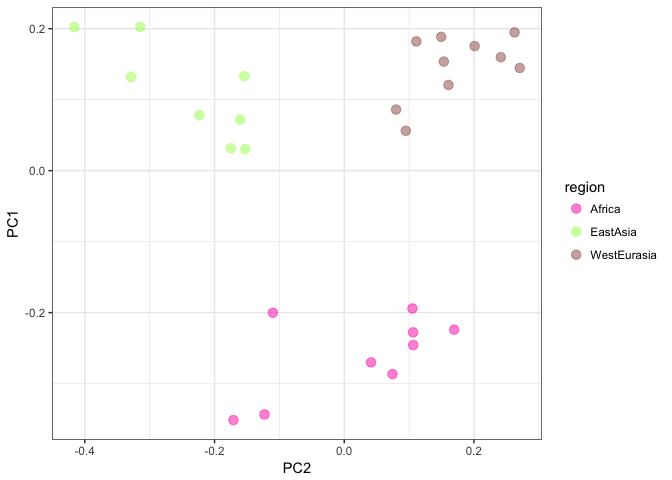

# Population Structure analysis

With the advent of SNP data it is possible to precisely infer the
genetic distance across individuals or populations. As written in the
book, one way of doing it is by comparing each SNP from each individual
against every other individual. This comparison produces the so called:
covariance matrix, which in genetic terms means the number of shared
polymorphisms across individuals. There are many ways to visualize this
data, in this tutorial you will be exposed to
`Principal Component Analysis` and `Admixture` software.

## Pricipal component analysis (PCA)

We will use the R package `SNPRelate`, which can easily handle vcf files
and do the PCA. If you want to explore a bit more on the functionality
of the package access
[here](https://www.rdocumentation.org/packages/SNPRelate/versions/1.6.4).

We are going to use these files throughout the exercise:

```bash
~/populationgenomics/data/vcf/chr2_135_145_flt.vcf.gz
~/populationgenomics/data/metadata/sample_infos_accessionnb.csv
```

Now run `slurm-jupyter` as your learnt in the first exercise. Once juypter is running, create a new R notebook and run the following code in aseparate code cells:

to create softlinks from the notebook you can write 
```
%%bash
ln -s ~/populationgenomics/data/vcf/chr2_135_145_flt.vcf.gz
ln -s ~/populationgenomics/data/metadata/sample_infos_accessionnb.csv
```


## if my environment works, you should start by opening a notebook and call these commands
```
import rpy2
%load_ext rpy2.ipython
```
Now you can jump from python cells to R cells by writing %%R in the start of the cell if you want to run R within that cell. Be aware that you'll have to write it in each cell you want to execute R within.

```
%%R
library(SNPRelate)
```

## if it didnt download the files and run everthing in your own r studio by using thse commands 
```R
# Dependencies
Sys.setenv(https_proxy = "http://proxyserv:3128", http_proxy = "http://proxyserv:3128")
BiocManager::install(c("SNPRelate"))

library(SNPRelate)
library(ggplot2)
```

```R
%%R #if your are on slurm-jupyter, not if you are on your own computer
# Reading the metadata information 
info <- read.csv("sample_infos_accessionnb.csv", header = T, sep = ';')
```

```R
# Setting the directory of the VCF file 
vcf.fn <- "chr2_135_145_flt.vcf.gz"

# Transforming the vcf file to gds format
snpgdsVCF2GDS(vcf.fn, "chr2_135_145_flt.gds", method="biallelic.only")
```

The total number of PCs can be estimated as the minimum between the total number of samples - 1 and the number of predictors.

```R
n_pcs = min(27-1,49868)
```

```R
genofile <- snpgdsOpen("chr2_135_145_flt.gds",  FALSE, TRUE, TRUE)
pca <- snpgdsPCA(genofile,eigen.cnt=n_pcs)
```

```R
summary(pca)
```

**Q.1** How many individuals and snps does this dataset have? What is an
eigenvector and an eigenvalue? Hint: Have a look at page 180 of HEG.


```R
    eigenvectors = as.data.frame(pca$eigenvect)
    colnames(eigenvectors) = as.vector(sprintf("PC%s", seq(1:n_pcs)))

    # Matching the sample names with their origin and population
    eigenvectors$region = info[match(pca$sample.id, info$ENA.RUN),]$region 
    eigenvectors$population = info[match(pca$sample.id, info$ENA.RUN),]$population
```

Let's first look at how much of the variance of the data is explained by
each eigenvector:


```R
    # Variance proportion:
    pca_percent <- pca$varprop*100

    qplot(y = pca_percent, x = seq(1, length(pca$eigenval))) + geom_line() + geom_point() + theme_bw() + xlab("PC's") + ylab("Variance explained (%)") 
```


**Q.2** How many PC's do we need in order to explain 50% of the variance
of the data? Can you make a cumulative plot of the variance explained
PC?

Now, let's plot the two first PC's and color the datapoints by the
origin of each individual sample.

```R
ggplot(data = eigenvectors, aes(x = PC1, y = PC2, col = region)) + 
        geom_point(size=3,alpha=0.5) +
        scale_color_manual(values = c("#FF1BB3","#A7FF5B","#99554D")) +
        theme_bw()
```


**Q.3** Try to plot PC2 and PC3. Do you see the same patterns? What is
the correlation between PC2 and PC3 (hint use the function cor())?

**Q.4** Try also to color the graph based on population. What do you
observe?

Now we will implement LD prunning.

```R
set.seed(1000)

# This function prune the snps with a thrshold of maximum 0.3 of LD
snpset <- snpgdsLDpruning(genofile, ld.threshold=0.3)
```
Note: HapMap data uses tag SNPs, i.e SNPs that contain non-redundant information to differentiate between haplotypes. 

```R
# Get all selected snp's ids
snpset.id <- unlist(snpset)
pca_pruned <- snpgdsPCA(genofile, snp.id=snpset.id, num.thread=2, ,eigen.cnt=n_pcs)
```

```R
eigenvectors = as.data.frame(pca_pruned$eigenvect)
colnames(eigenvectors) = as.vector(sprintf("PC%s", seq(1:n_pcs)))

# Matching the sample names with their origin and population
eigenvectors$region = info[match(pca_pruned$sample.id, info$ENA.RUN),]$region 
eigenvectors$population = info[match(pca_pruned$sample.id, info$ENA.RUN),]$population

ggplot(data = eigenvectors, aes(x = PC1, y = PC2, col = region)) + 
        geom_point(size=3,alpha=0.5) +
        scale_color_manual(values = c("#FF1BB3","#A7FF5B","#99554D")) +
        theme_bw() + coord_flip()
```



**Q.5** Implement different LD thresholds (0.1, 0.2, 0.3, 0.4, 0.5). How
many SNPs are left after each filtering threshold? Are these SNPs
linked?

Now we are going to convert this GDS file into a plink format, to be
later used in the admixture exercise:

```R
snpgdsGDS2BED(genofile, "chr2_135_145_flt_prunned.gds", sample.id=NULL, snp.id=snpset.id, snpfirstdim=NULL, verbose=TRUE)
```

Upload the 3 files produced by this last code
(**chr2\_135\_145\_pruned.gds.bed**,
**chr2\_135\_145\_pruned.gds.bim** and
**chr2\_135\_145\_pruned.gds.fam**) to you own folder on
the cluster.


## Log into the cluster and request a compute node

Log into the cluster. Then request a machine for your computations. You need five gigabytes (`5g`) in this exercise so you need to run this command (see also the explanation in the previous exercise):

```bash
srun --mem-per-cpu=5g --time=3:00:00 --account=populationgenomics --pty bash
```

## Admixture

Admixture is a program for estimating ancestry in a model based manner
from SNP genotype datasets, where individuals are unrelated.
The input format required by the software is in binary PLINK (.bed)
file. That is why we converted our vcf file into .bed.

Now with adjusted format and pruned snps, we are ready to run the
admixture analysis. We believe that our individuals are derived from
three ancestral populations:

```bash
admixture chr2_135_145_flt_prunned.gds.bed 3
```

**Q.6** Have a look at the Fst across populations, that is printed in
the terminal. Would you guess which populations are Pop0, Pop1 and Pop2
referring to?

After running admixture, 2 outuputs are generated:

-   `Q`: the ancestry fractions

-   `P`: the allele frequencies of the inferred ancestral populations

Sometimes we may have no priori about K, one good way of choosing the
best K is by doing a cross-validation procedure impletemented in
admixture as follow:

```bash
for K in 1 2 3 4 5; \
    do admixture --cv chr2_135_145_flt_prunned.gds.bed $K | tee log${K}.out; done
```
      
Have a look at the Cross Validation error of each K:

```bash
grep -h CV log*.out
```

Save it in a text file:

```bash
grep -h CV log*.out > CV_logs.txt
```

Look at the distribution of CV error. You can download your file to your
own computer or run it in the cluster using slurm-jupyter.

```R
CV = read.table('CV_logs.txt')
p <- ggplot(data = CV, aes(x = V3, y = V4, group = 1)) + geom_line() + geom_point() + theme_bw() + labs(x = 'Number of clusters', y = 'Cross validation error')

p
```


**Q.7** What do you understand of Cross validation error? Based on this
graph, what is the best K?

Plotting the Q estimates. Choose the K that makes more sense to you.

```R
tbl = read.table("chr2_135_145_flt_prunned.gds.3.Q")
ord = tbl[order(tbl$V1,tbl$V2,tbl$V3),]
bp = barplot(t(as.matrix(ord)), 
            space = c(0.2),
            col=rainbow(3),
            xlab="Individual #", 
            ylab="Ancestry",
            border=NA,
            las=2)
```


Note: Here we order the X-axis based on proportions for the first population component. However, you will see that in the HapMap data all the individuals show some portion of this component and the different individuals are more admixed in general, i.e they are no longer explained by mostly one component, it’s not useful to use that kind of ordering anymore to interpret the plot. Instead, we should keep the original order, since the files are originally ordered by population, and we should plot each population on the X axis to be able to interpret the plot. This can be achieved with something of the type:

```R
library(dplyr)
info <- info[match(pca$sample.id,info$ID),]
d <- info %>% group_by(population) %>%
  summarise(n = n()) %>% mutate(cumsum = cumsum(n))
tbl = read.table("hapmap.gds.6.Q")
barplot(t(as.matrix(tbl)),
              space = c(0.01),
              col=rainbow(6),
              ylab="Ancestry",
              border=NA)
axis(1, at=d$cumsum, labels=d$population,las=2)
```

**Q.8** How many clusters do you identify in this plot? Does that agree
with what was found using PCA?

In the following part of this exercise you will do both analysis (PCA
and Admixture) using a different dataset. The data comes from the HAPMAP
Consortium, to learn more about the populations studied in this project
access
[here](http://www.sanger.ac.uk/resources/downloads/human/hapmap3.html).
The vcf file **hapmap.vcf**, an information file **relationships\_w\_pops\_121708.txt**, as well as
**.bim**, **.bed**, **.fam** files (only to be used if you get stuck during the exercise) are available for the admixture
analysis, this dataset is placed in the cluster, here:

~/populationgenomics/data/assignment

Answer the same questions
as answered in this tutorial and write a report (5 pages maximum) about
the results and the analysis you have done. 
