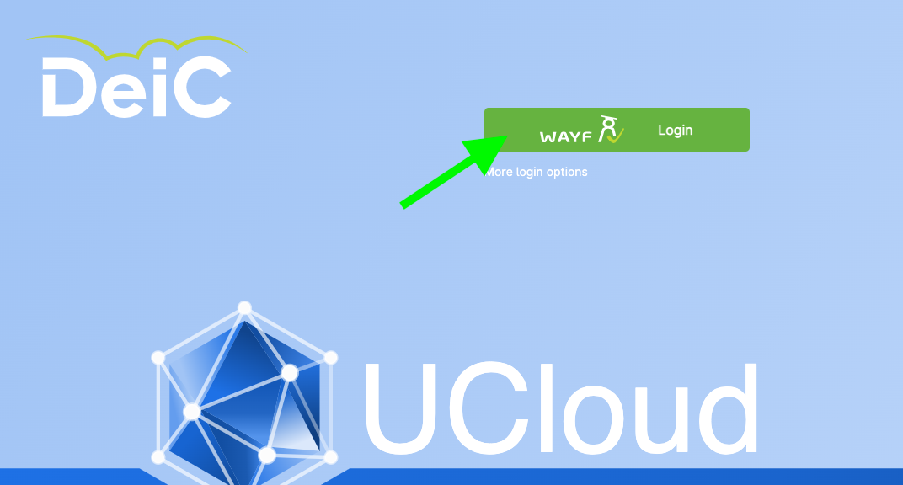
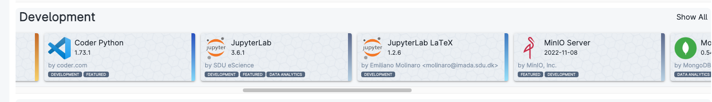
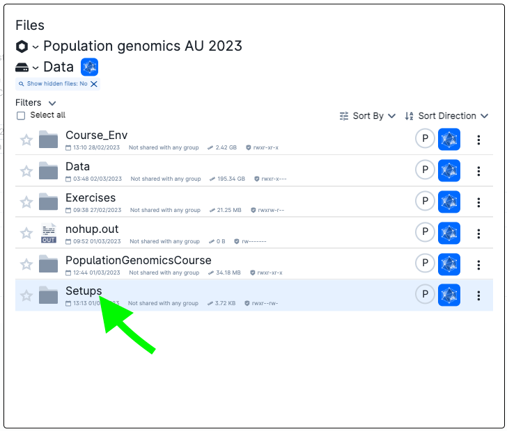
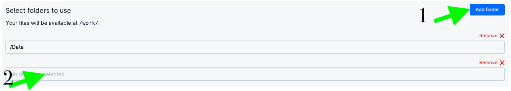

# Instructions

You have various options to run the course material. You can execute it on a supercomputing system or on your own computer.

## Access the material during the physical course

`Ucloud` is an interactive online platform from the [University of Southern Danmark eScience center](https://escience.sdu.dk/) that allows users to execute softwares and computer code directly from their browser. If you are enrolled in a danish university or other scientific institution, you can access the platform for free and try the course.

Please follow these instructions to access uCloud and get access to the course:

* To access uCloud for the first time, go to the [ucloud webpage](https://cloud.sdu.dk) and log in by pressing on the green button and writing your credentials. If you have a mail address from a danish institution or university, you should be able to login with your institutional credentials.

* Once you log into uCloud, you should see a dashboard window similar to the one below
  

* On top of this page you have `My Workspace`. That is your private space where you have some free hundreds of CPU hours and GBs of memory to run different applications (that you can see by using the menu `Apps` on the left). If you have been invited into the course project, click on the workspace name and choose the project from the menu opening there. In this way you will have access to the course data and packages.
  
 
* Click on `Apps` and find the application called `Jupyterlab` (Under the title `Development`). Click on it. Be careful not to choose the app called `Jupyterlab (Type 3)`.

* When the app is opened, click on `Import parameters --> Import from Ucloud` and choose the file `JobParameters.json` from the folder `Setups`

* Now add the folder containing the exercises you copied. Click on `Add folder` and on the empty text bar appearing below. Browse to your personal folder and choose the exercise folder.
 

* Click on submit. You will be waiting in queue. When the job is running, wait around 1-2 minutes (installations will be running in backgroun), then click on `Open Interface`.